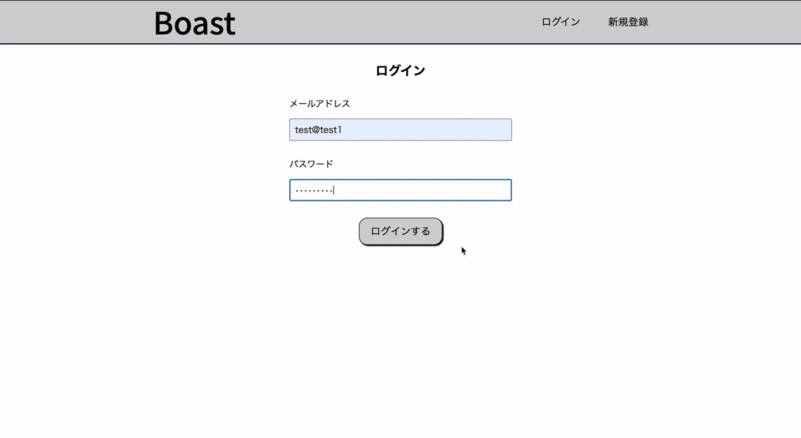

# Boast

## App URL
<a href="http://18.176.181.238/" target="_blank">Boast</a>

## Twitter URL
<a href="https://twitter.com/Kenta65791378" target="_blank">Twitter</a>

## Qiita URL
<a href="https://qiita.com/75ks" target="_blank">Qiita</a>

## 概要
- ユーザー登録、編集、削除、ログイン
- テキスト、画像の投稿、編集、削除
- 投稿の確認
- 投稿にコメントの投稿、削除
- 投稿にいいね

## Basic認証
ユーザー名: admin  
パスワード: 28250

## テスト用アカウント
①  
メールアドレス: test@test1  
パスワード: testtest1  

②  
メールアドレス: test@test2  
パスワード: testtest2  

## 利用方法
- 新規登録(登録済の方はログイン)をする
- ヘッダーの左側の「Boast」を押すとトップページに遷移し、右側の「ユーザー名」をクリックするとマイページに遷移する
- ヘッダーの右側の「ログアウト」を押すとログアウトできる
- トップページのヘッダー下の「ALL」を押すと全ての投稿、「MEN」を押すと男性の投稿、「WOMEN」を押すと女性の投稿を表示する
- マイページのヘッダー下の「自分の投稿」を押すと自分の投稿、「いいねした投稿」を押すと自分がいいねした投稿を表示する
- トップページまたはマイページから「投稿」を押し、画像とテキストを投稿することができる
- トップページやマイページから投稿画像を押すと投稿の詳細ページに遷移する
- 詳細ページでは自分の投稿に限り、「編集」、「削除」を表示し、押すと投稿の編集や削除ができる
- 詳細ページの最下部にあるコメント欄から投稿にコメントすることができる
- 詳細ページでは自分の投稿に限り、コメントの右側に「ゴミ箱」を表示し、押すとコメントを削除できる
- マイページの「ユーザー編集」を押すとユーザー情報を編集や削除ができる
- 投稿の「♡」を押すと投稿にいいねすることができ、隣の「いいねの数」を押すといいねしたユーザーの表示、非表示を切り替える

## 目指した課題解決
ユーザーが、ファッションコーディネートや、ファッションアイテムを専門で投稿できるものを作るため、このアプリケーションを作成した。

## 洗い出した要件定義

| 優先順位 （高：3、中：2、低：1） | 機能 | 目的 | 詳細 | ストーリー(ユースケース) | 見積もり（所要時間） |
| :-: | :-: | :-: | :-: | :-: | :-: |
| 3 | 投稿一覧機能 | 投稿を見られるようにするため | 一覧ページを作成しトップページにする。投稿されたテキスト、画像、ユーザー名を表示する。 | ログイン後、ヘッダー左側の「Boast」を押し、トップページに遷移する。 | 3時間 |
| 3 | 投稿詳細機能 | 投稿を詳しく見られるようにするため | 詳細ページを作成する。投稿情報を見られるようにする。 | トップページの投稿画像を押し、詳細ページに遷移する。 | 3時間 |
| 3 | 投稿作成機能 | 投稿をできるようにするため | 一覧ページとマイページに「投稿」ボタンを作成する。投稿作成ページを作成する。画像、テキストを保存できるようにする。 | トップページかマイページから右下の「投稿」を押し、作成ページに遷移し、画像を選択し、テキストを入力する。 | 3時間 |
| 3 | 投稿編集機能 | 投稿を編集できるようにするため | 編集ページを作成する。詳細ページに投稿者のみ「編集」ボタンを表示する。「編集」ボタンを押したら編集ページに遷移する。登録済の情報を表示する。画像、テキストを更新できるようにうする。 | 自分の投稿の詳細ページに行き、「編集」を押し、編集ページに遷移し、情報を編集する。 | 3時間 |
| 3 | 投稿削除機能 | 投稿を削除できるようにするため | 詳細ページに投稿者のみ「削除」ボタンを表示する。「削除」ボタンを押すと削除できる。削除後は一覧ページに遷移する。 | 自分の投稿の詳細ページに行き、「削除」を押す。 | 2時間 |
| 3 | ユーザー管理機能 | ユーザーを登録できるようにするため | deviseを使う。ログインページ、新規登録ページを作成する。メールアドレス、パスワードでログインできるようにする。ニックネーム、性別、メールアドレス、パスワーを保存できるようにする。ログイン、新規登録後は一覧ページに遷移する。ログアウト状態はログインページに遷移するようにする。 | アプリを開くとログインするためにログインページに遷移する。アカウントを持っている場合は、ログインフォームを入力する。アカウントを持っていない場合は、ヘッダー右側の「新規登録」から登録ページに遷移し、フォームを入力してアカウントを作成する。 | 4時間 |
| 2 | コメント機能 | 投稿にコメントできるようにするため | 詳細ページにコメント欄を作成する。テキストを保存できるようにする。 | 投稿の詳細ページに遷移し、最下部にあるフォームにコメントを入力する。 | 3時間 |
| 2 | いいね機能 | 投稿にいいねできるようにするため | 一覧ページ、詳細ページ、マイページから投稿にいいねできるようにする。Ajaxを使って実装する。 | トップページ、マイページ、詳細ページから投稿の「♡」を押す。 | 6時間 |
| 2 | ユーザー編集機能 | ユーザー情報を編集できるようにするため | 編集ページを作成する。マイページに「ユーザー編集」ボタンを作成する。「ユーザ編集」ボタンを押したら編集ページに遷移する。ニックネーム、性別、メールアドレス、パスワードを編集できるようにする。 | マイページから「ユーザー編集」を押し、編集ページに遷移し、情報を編集する。 | 4時間 |
| 2 | ユーザー削除機能 | ユーザーを削除できるようにするため | 編集ページに「削除」ボタンを作成し、情報を削除できるようにする。 | マイページから「ユーザー編集」を押し、編集ページに遷移し、最下部の「削除」を押す。 | 2時間 |
| 2 | 投稿性別検索機能 | 性別で投稿の表示を分けるようにするため | 性別検索ページを作成する。一覧ページに「ALL」「MEN」「WOMEN」ボタンを作成する。「ALL」はすべての投稿、「MEN」は男性の投稿、「WOMEN」は女性の投稿を表示する。 | トップページのヘッダー下の「ALL」「MEN」「WOMEN」を押す。 | 5時間 |
| 2 | 複数画像投稿機能 | 1度の投稿に複数の画像を投稿できるようにするため | 作成ページ、編集ページで画像を選択したときにプレビュー機能を実装する。2枚目の画像を選択すると、これ以上画像を選択できなくなるようにする。 | トップページかマイページから右下の「投稿」を押し、作成ページに遷移し、画像を複数枚選択し(2枚までしか選択できない)、テキストを入力する。 | 4時間 |
| 1 | ページネーション機能 | 投稿表示数を制限するため | kaminariを使う。一覧ページ、マイページに5件まで投稿を表示し、それ以外は次のページに表示する。 | トップページ、マイページで投稿が6件以上ある場合は、最下部にページ切り替えボタンが表示されるので押して次のページに遷移する。 | 2時間 |
| 1 | いいね投稿表示機能 | いいねした投稿を確認できるようにするため | いいねした投稿が表示されるページを作成する。マイページに「いいねした投稿」というボタンを作成する。「いいねした投稿」というボタンを押すと遷移できるようにする。 | マイページのヘッダー下の「いいねした投稿」を押す。 | 5時間 |
| 1 | いいねしたユーザー表示機能 | 投稿にいいねしたユーザーを確認できるようにするため | 一覧ページ、マイページに投稿にいいねしたユーザーを表示する。非同期で実装する。いいね数を押したら表示、非表示を切り替えられるようにする。 | トップページ、マイページで投稿の「♡」の右隣にあるいいね数を押す。 | 5時間 |
| 1 | コメント削除機能 | 投稿のコメントを削除できるようにするため | 詳細ページのコメント一覧に投稿者のみ「削除」ボタンを表示する。「ゴミ箱」ボタンを押すと削除できる。削除後は詳細ページに遷移する。 | 自分の投稿の詳細ページに行き、「ゴミ箱」ボタンを押す。 | 1時間 |
| 1 | 画像スワイプ機能 | 複数画像を投稿した場合、スワイプで切り替わるようにするため | Swiperを使う。投稿、編集時に画像を2枚選択した場合、スワイプまたは矢印で画像を切り替えられるようにする。ページネーション機能を実装し、何枚目の画像を表示しているのかを可視化する。 | トップページ、マイページで投稿画像をスワイプするか、矢印を押す。 | 4時間 |
| 1 | フォロー機能 | ユーザーをフォローできるようにするため | ユーザーページの「ユーザーの投稿」「いいねした投稿」から「フォロー」を押すとフォローできる。フォロー後はユーザーページに遷移し、「フォロー」が「アンフォロー」に変化する。「アンフォロー」を押すとフォローを解除できる。フォロー解除後はユーザーページに遷移し、「アンフォロー」が「フォロー」に変化する。 | ユーザーページに行き、「フォロー」ボタンを押す。 | 5時間 |

## 実装した機能についてのGIFと説明
<h3 align="center">- ログイン -</h3>

ログインページからメールアドレスとパスワードを入力してログインすることができる。

  

<h3 align="center">- 投稿 -</h3>

投稿ページから画像を選択し、テキストを入力することで投稿することができる。画像は2枚まで選択可能。

  

<h3 align="center">- コメント -</h3>

詳細ページから最下部のフォームにテキストを入力することでコメントを投稿することができる。

  

<h3 align="center">- いいね -</h3>

トップページ、マイページ、詳細ページから投稿の「♡」を押すことで投稿をいいねすることができる。「♡」の右隣の数字を押すと投稿にいいねしたユーザーの表示、非表示を切り替えることができる。

  

<h3 align="center">- 性別分け投稿表示 -</h3>

トップページのヘッダー下の「ALL」を押すとすべての投稿、「MEN」を押すと男性の投稿、「WOMEN」を押すと女性の投稿を表示することができる。

  

<h3 align="center">- ページネーション機能 -</h3>

1ページに投稿を5件まで表示し、それ以上投稿が存在する場合は、次のページに分けることができる。

  

<h3 align="center">- 画像スワイプ機能 -</h3>

画像を2枚投稿した場合、画像をスワイプか「<」「>」を押すことにより、切り替えることができる。

  

<h3 align="center">- フォロー機能 -</h3>

ユーザーページから「フォロー」を押すとユーザーをフォローし、「アンフォロー」に表示が変わる。「アンフォロー」を押すとユーザーのフォローを解除でき、「フォロー」に表示が変わる。

  

## 工夫したポイント
性別で分けて投稿を表示させる機能を実装したところ。  
投稿内容がファッション関係のものとなっているため、男女で投稿を分けることで、ユーザが使いやすくなると思った。

## 実装予定の機能
ブランドタグを追加してより詳細な検索ができるようにする。

## テスト
RSpecを使ったモデルの正常系、異常系の単体テストコード。

## 使用技術
- ruby 2.6.5
- rails 6.0.0
- rspec-rails 4.0.1
- jquery 3.3.1
- capistrano 3.14.1
- Web Server Nginx
- Application Server Unicorn
- Amazon S3

## 本番環境
AWS(EC2)

## ローカルでの動作方法
`$ git clone https://github.com/75ks/boast.git`  
`$ cd boast`  
`$ bundle install`  
`$ rails db:create`  
`$ rails db:migrate`  
`$ rails s`  
👉 http://localhost:3000

## データベース設計

### users テーブル

| Column       | Type    | Options     |
| ------------ | ------- | ----------- |
| email        | string  | null: false |
| password     | string  | null: false |
| nickname     | string  | null: false |
| gender_id    | integer | null: false |

#### Association

- belongs_to_active_hash :gender
- has_many               :posts, dependent: :destroy
- has_many               :comments, dependent: :destroy
- has_many               :favorites, dependent: :destroy
- has_many               :favorite_posts, through: :favorites, source: :post
- has_many               :relationships
- has_many               :followings, through: :relationships, source: :follow
- has_many               :reverse_of_relationships, class_name: 'Relationship', foreign_key: 'follow_id'
- has_many               :followers, through: :reverse_of_relationships, source: :user

### posts テーブル

| Column | Type          | Options                        |
| ------ | ------------- | ------------------------------ |
| text   | text          | null: false                    |
| user   | references    | null: false, foreign_key: true |

#### Association

- has_many          :comments, dependent: :destroy
- has_many          :favorites, dependent: :destroy
- belongs_to        :user
- has_many_attached :images

### comments テーブル

| Column | Type       | Options                        |
| ------ | ---------- | ------------------------------ |
| text   | text       | null: false                    |
| user   | references | null: false, foreign_key: true |
| post   | references | null: false, foreign_key: true |

#### Association

- belongs_to :user
- belongs_to :post

### favorites テーブル

| Column | Type       | Options                        |
| ------ | ---------- | ------------------------------ |
| user   | references | null: false, foreign_key: true |
| post   | references | null: false, foreign_key: true |

#### Association

- belongs_to :user
- belongs_to :post

### relationships テーブル

| Column | Type       | Options                           |
| ------ | ---------- | --------------------------------- |
| user   | references | foreign_key: true                 |
| follow | references | foreign_key: { to_table: :users } |

#### Association

- belongs_to :user
- belongs_to :follow, class_name: 'User'
